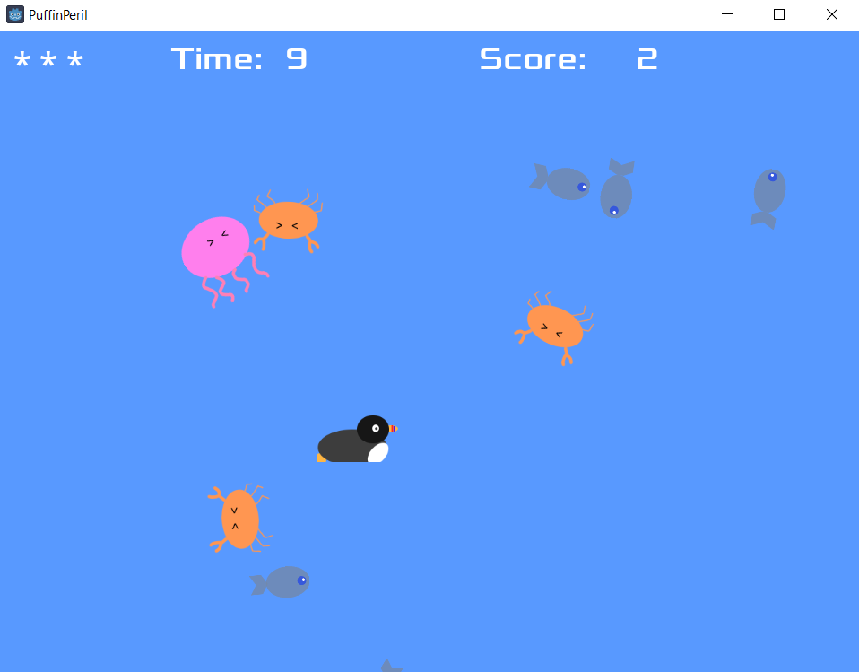

# Puffin Peril

A simple 2D desktop game in Godot expanding on the ["First 2D game" tutorial](https://docs.godotengine.org/en/stable/getting_started/first_2d_game/index.html).

Added second group of dynamically spawned scenes. Points scored when intesecting fish, and lives deducted when intersecting enemies. Appropriate squawk sounds triggered.
Simple custom sprites with animation.

---

Help the puffin to catch as many fish as possible in 30 seconds whilst avoiding being stung by jellyfish or pinched by crabs!

Complete with authentic puffin noises [(thanks BBC Sound Effects)](https://sound-effects.bbcrewind.co.uk/search?q=puffin) !

